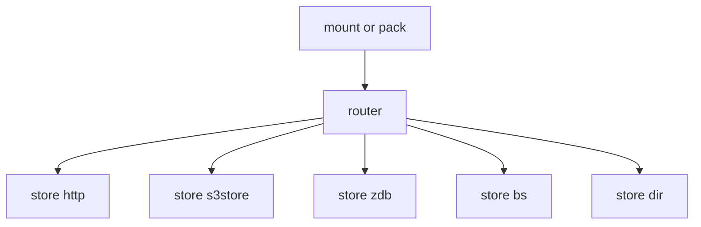

# ADR-0004: Storage backends and routing

## Metadata
- ID: ADR-0004
- Title: Storage backends and routing
- Status: Proposed
- Date: 2025-10-02
- Deciders: RFS core maintainers
- Tags: storage, routing, backends, s3, http, zdb
- Supersedes: None
- Superseded by: None

## Context
RFS stores content-addressed blocks referenced by flists and retrieves them lazily during mount. Backends persist and serve these blocks; during pack/upload they accept writes for missing blocks. A routing layer maps content hashes or prefix ranges to one or more backends to support scaling, sharding, migration, and redundancy.

Constraints and goals:
- Compatibility with existing flists that embed route information without secrets; routes must be usable to reconstruct client routing.
- Support heterogeneous backends with differing auth/transport and failure domains.
- Keep latency predictable under mixed backends and distribute load.
- Do not persist credentials inside flists; sanitize or redact when writing metadata.

See background in [docs/architecture/storage-backends.md](docs/architecture/storage-backends.md), [docs/call-stacks/mount.md](docs/call-stacks/mount.md), and [docs/call-stacks/pack.md](docs/call-stacks/pack.md).

## Decision
- Router-based dispatch — Current: A router selects the backend by content hash or hash-prefix mapping, using range or shard assignments. See [src/store/router.rs](src/store/router.rs).
- Backend abstraction — Current: Backends implement a common interface under [src/store/mod.rs](src/store/mod.rs), enabling pluggable implementations such as [src/store/http.rs](src/store/http.rs), [src/store/s3store.rs](src/store/s3store.rs), [src/store/zdb.rs](src/store/zdb.rs), [src/store/bs.rs](src/store/bs.rs), and [src/store/dir.rs](src/store/dir.rs).
- Read path — Current: The mount flow consults the router to fetch blocks; on success, data is returned to the cache and consumer; on failure, errors are mapped consistently. See [docs/call-stacks/mount.md](docs/call-stacks/mount.md).
- Write path — Current: Pack/upload uses the same routing to choose targets; credentials are not persisted in flists and are redacted or omitted. See [docs/architecture/adr/ADR-0001-metadata-and-pack-pipeline.md](docs/architecture/adr/ADR-0001-metadata-and-pack-pipeline.md).
- Multi-backend policy — Proposed: Support sharding and optional fan-out, plus gradual migration via route table updates and prefix reassignments with non-destructive transitions.
- Fault handling — Proposed: Apply retry and backoff tuned per backend class with circuit-breaker-like behavior; when safe and configured, degrade to alternates.
- Observability — Proposed: Expose per-backend metrics for latency, errors, and throughput; log router decisions for troubleshooting.

## Rationale
- Scalability: Sharding by hash prefix spreads load and capacity across backends.
- Portability: A uniform backend trait keeps code cohesive while allowing heterogeneity.
- Resilience: Multiple targets and fallback reduce blast radius of partial outages.
- Operational flexibility: Routing enables live migrations and tiering without repacking flists.
- Separation of concerns: Router policy is independent of backend mechanics; flist routes remain filename-linked and secret-free.

## Alternatives Considered
- Single monolithic backend without routing.
- DNS-based sharding external to clients.
- Client-side consistent hashing without explicit routes in flists.
- Per-file whole-object storage without block routing.
- Push-based replication instead of router selection.

## Consequences
Positive:
- Horizontal scalability across backends and regions.
- Backend heterogeneity with a stable client interface.
- Incremental, non-destructive migrations.

Negative:
- Added complexity in routing policy and configuration.
- Cross-backend error handling and retries are more involved.
- Need to keep router config coherent with flists and CLI behavior.

## Implementation Notes
High-level mapping to code and flows:
- Router in [src/store/router.rs](src/store/router.rs) delegates to backends under [src/store/](src/store/).
- Interacts with mount read path and pack upload path as shown in [docs/call-stacks/mount.md](docs/call-stacks/mount.md) and [docs/call-stacks/pack.md](docs/call-stacks/pack.md).
- Route table materialized from CLI or config and from flist metadata; credentials are redacted in persisted metadata.
- Migration flows — Proposed: route updates can shift prefixes to new backends; background copy or on-demand fill can move blocks safely.

Diagram:

## Security and Privacy
- Secrets are handled by backend configuration at runtime; flists must exclude credentials.
- Use secure transport and auth per backend type; prefer TLS for HTTP and proper IAM for S3-compatible systems.
- Validate content by hash on retrieval; surface mismatches as integrity errors.

## Operational Considerations
- Configuration management of route tables; validate and version configs.
- Safe rotation and migrations; ability to dry-run and roll back.
- Health checks and per-backend concurrency limits.
- Handle partial outages and brownouts with backoff and optional fallback.

## Performance and Scaling
- Routing granularity: prefix width affects balance vs metadata size.
- Account for backend latency variability; parallelize fetch and upload across shards.
- Align router with cache and data locality to improve hit rates and throughput.

## Open Questions
- Exact route spec schema and versioning.
- Live reconfiguration and propagation to running mounts.
- Write affinity vs read locality and how to balance them.
- Cross-region routing and data sovereignty constraints.
- Verification of supported backends and feature parity.

## References
- [docs/architecture/storage-backends.md](docs/architecture/storage-backends.md)
- [docs/call-stacks/mount.md](docs/call-stacks/mount.md)
- [docs/call-stacks/pack.md](docs/call-stacks/pack.md)
- [docs/function-index.md](docs/function-index.md)
- [src/store/router.rs](src/store/router.rs)
- [src/store/mod.rs](src/store/mod.rs)
- [src/store/http.rs](src/store/http.rs)
- [src/store/s3store.rs](src/store/s3store.rs)
- [src/store/zdb.rs](src/store/zdb.rs)
- [src/store/bs.rs](src/store/bs.rs)
- [src/store/dir.rs](src/store/dir.rs)
- [src/main.rs](src/main.rs)

## Changelog
- 2025-10-02 — Created