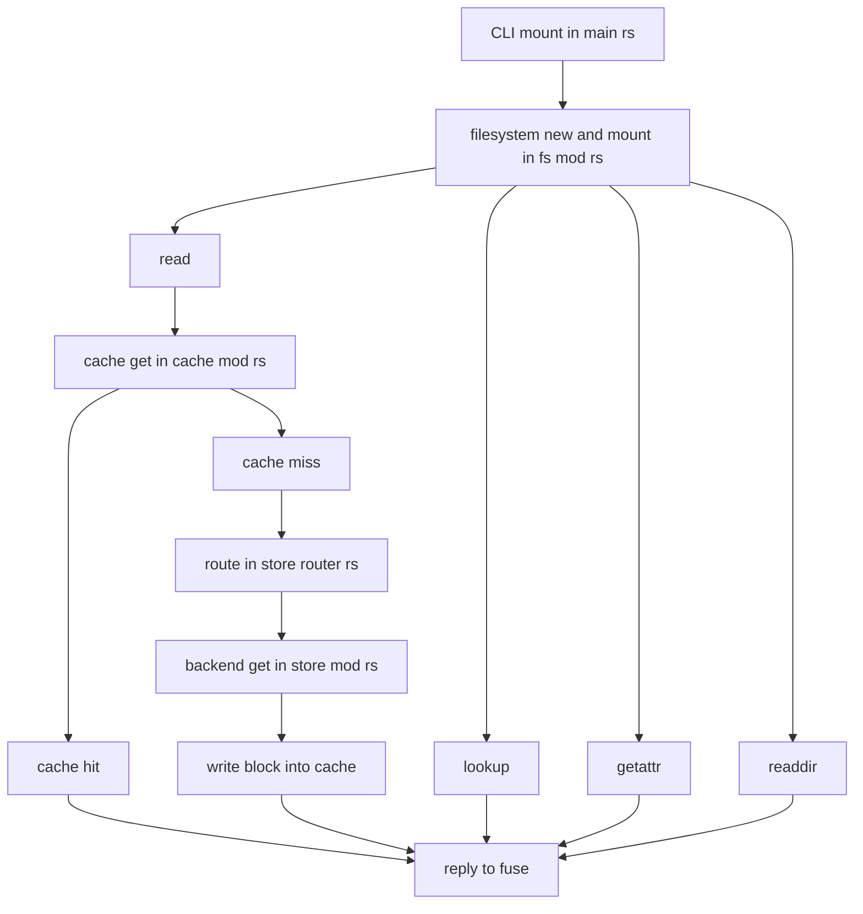

# Mount Call Stack

The mount flow initializes a FUSE filesystem over an flist, serving file bytes lazily via a cache backed by routed storage backends. Inputs are the flist metadata and cache location plus store routing. Outputs are FUSE responses to kernel operations and populated cache files for requested blocks.

Contents

- [Overview](#overview)
- [Mermaid Diagram](#mermaid-diagram)
- [Key Steps](#key-steps)
- [Data Artifacts](#data-artifacts)
- [Related Files](#related-files)

## Overview

CLI parsing in [src/main.rs](src/main.rs) invokes the mount path, which constructs a Filesystem over metadata and cache in [src/fs/mod.rs](src/fs/mod.rs) and starts a FUSE session. Kernel requests like lookup, getattr, readdir, and read are handled using metadata and a lazy block cache in [src/cache/mod.rs](src/cache/mod.rs). On cache misses, the cache fetches from stores via routing in [src/store/router.rs](src/store/router.rs) and backend implementations in [src/store/mod.rs](src/store/mod.rs).

## Mermaid Diagram

## Key Steps

- Parse CLI and prepare metadata reader, cache path, and store routing in [src/main.rs](src/main.rs).
- Initialize Filesystem with Reader and Cache in [src/fs/mod.rs](src/fs/mod.rs) and start FUSE session.
- Handle lookup by resolving name to inode via metadata and reply with EntryOut.
- Handle getattr by loading inode and filling FileAttr for reply.
- Handle readdir by paging children from metadata and streaming entries to the kernel buffer.
- Handle read by mapping file offset to block index and consulting the LRU or cache for a block fd.
- On cache hit, read the requested bytes from the cached block and reply to the kernel.
- On cache miss, serialize population with a lock, fetch bytes from the store, write to cache, then serve the read.
- Route store fetches by prefix using [src/store/router.rs](src/store/router.rs) and dispatch to concrete backends via [src/store/mod.rs](src/store/mod.rs).
- Maintain LRU of open block descriptors to optimize repeated reads within a block.

## Data Artifacts

- FUSE replies — EntryOut, AttrOut, ReaddirOut, read buffers returned to the kernel.
- Cache files — on disk block files addressed by id and key, populated on demand.
- LRU entries — open file descriptors and sizes for recently accessed blocks.
- Metadata reader state — inodes, children pages, and block lists from the flist.
- Router configuration — prefix to backend mapping derived from flist or config.

## Related Files

- [src/main.rs](src/main.rs)
- [src/fs/mod.rs](src/fs/mod.rs)
- [src/cache/mod.rs](src/cache/mod.rs)
- [src/store/router.rs](src/store/router.rs)
- [src/store/mod.rs](src/store/mod.rs)