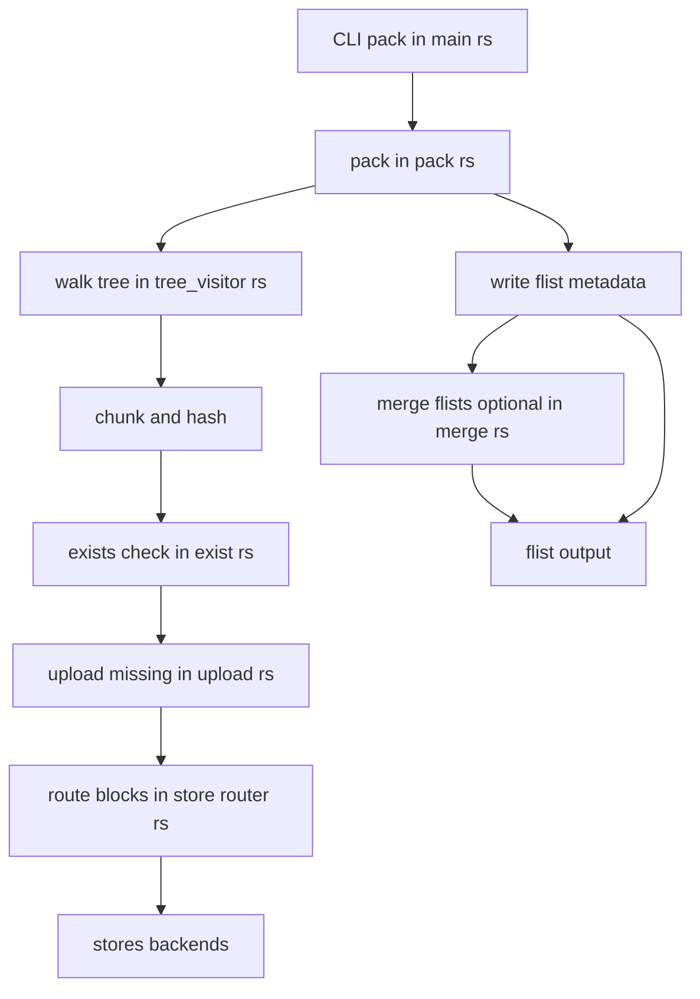

# Pack Call Stack

The pack flow builds an flist from a local directory by traversing the tree, chunking files, hashing content, and uploading only missing blocks through the configured stores. It writes routing info into the flist, records inodes and block references, and returns a metadata file usable by mount and unpack. Primary inputs are a source root and store configuration; outputs are the flist and uploaded block objects.

Contents

- [Overview](#overview)
- [Mermaid Diagram](#mermaid-diagram)
- [Key Steps](#key-steps)
- [Data Artifacts](#data-artifacts)
- [Related Files](#related-files)

## Overview

CLI parsing in [src/main.rs](src/main.rs) triggers the pack pipeline in [src/pack.rs](src/pack.rs), which initializes store routing, walks the source tree, and schedules concurrent file uploads. Helpers for hashing, existence checks, and selective upload are provided in [src/upload.rs](src/upload.rs) and [src/exist.rs](src/exist.rs), while merge and unpack participate in adjacent workflows that reuse the same artifacts via [src/merge.rs](src/merge.rs) and [src/unpack.rs](src/unpack.rs).

## Mermaid Diagram

## Key Steps

- Parse CLI options in [src/main.rs](src/main.rs) and construct writer and store configuration.
- Initialize routing in the writer from store routes, optionally stripping passwords before writing URLs.
- Walk the source tree iteratively in [src/pack.rs](src/pack.rs), creating directory, file, and symlink inodes in metadata.
- For each regular file, schedule concurrent uploads via a worker pool; compute content chunks and hashes per block.
- Check server-side existence of blocks and upload only missing ones using helpers in [src/exist.rs](src/exist.rs) and [src/upload.rs](src/upload.rs).
- Route block uploads by first byte through [src/store/router.rs](src/store/router.rs) to the configured backends.
- Record block ids and keys for each inode in the flist and persist the metadata.
- Aggregate and report failures; return success only when all files are processed.
- In related workflows, merge multiple flists using [src/merge.rs](src/merge.rs) or unpack to a directory with [src/unpack.rs](src/unpack.rs).

## Data Artifacts

- Flist metadata file — serialized tree of inodes with block references and store routes.
- Block objects — content addressed by id and key; stored in remote backends.
- Routing table — byte range to store URL mapping embedded in the flist.
- Failure log — list of files that failed to upload during the run.

## Related Files

- [src/main.rs](src/main.rs)
- [src/pack.rs](src/pack.rs)
- [src/tree_visitor.rs](src/tree_visitor.rs)
- [src/exist.rs](src/exist.rs)
- [src/upload.rs](src/upload.rs)
- [src/store/router.rs](src/store/router.rs)
- [src/merge.rs](src/merge.rs)
- [src/unpack.rs](src/unpack.rs)