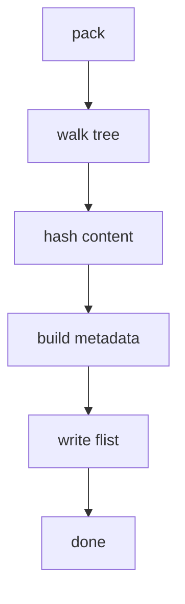

# RFS Documentation Conventions

This page defines the conventions all contributors must follow when writing and maintaining documentation for rfs. It standardizes locations, naming, linking, Rustdoc expectations, call stack diagrams, function indexes, and ADR lifecycle.

## Documentation locations

Put each doc type in the following canonical locations:

- Function index: [docs/function-index.md](docs/function-index.md)
- Call stack diagrams: [docs/call-stacks/](docs/call-stacks/) with one file per topic, for example [docs/call-stacks/pack.md](docs/call-stacks/pack.md) and [docs/call-stacks/mount.md](docs/call-stacks/mount.md)
- Architecture Decision Records: [docs/architecture/adr/](docs/architecture/adr/) with an index at [docs/architecture/adr/index.md](docs/architecture/adr/index.md)
- Basics overview: [docs/basics.md](docs/basics.md)
- Architecture overview reference: [docs/architecture/overview.md](docs/architecture/overview.md)

Do not create additional location trees for these doc types. If a new type is needed, add it here first.

## Filenames and numbering

- ADR files use: ADR-XXXX-kebab-title.md (four-digit, zero-padded IDs)
  - Reserve ADR-0000 as a reusable template
  - Examples:
    - ADR-0001-metadata-and-pack-pipeline.md
    - ADR-0002-fuse-lazy-loading.md
    - ADR-0003-cache-strategy.md
    - ADR-0004-storage-backends-routing.md
    - ADR-0005-server-api-and-block-serving.md
- Call stack files use: {topic}.md (e.g., pack.md, mount.md) in [docs/call-stacks/](docs/call-stacks/)
- Function index uses a single file: [docs/function-index.md](docs/function-index.md)

Numbering rules for ADRs:

- IDs are assigned sequentially when Proposed
- IDs are never reused
- When an ADR is replaced, add Superseded by and Supersedes links within the respective ADR files and update [docs/architecture/adr/index.md](docs/architecture/adr/index.md)

## Link formatting rule

Use filename links everywhere in narrative docs:

- Link files exactly like [README.md](README.md) or [docs/architecture/overview.md](docs/architecture/overview.md)
- Avoid language.declaration() links with line numbers in narrative docs because line numbers are volatile
- Reserve construct plus line links (for example rust.function_name() at src/some/file.rs:123) only for generated indexes where automation keeps them current

When cross-referencing code from prose, prefer linking the file (for example [src/pack.rs](src/pack.rs)) and name the construct in text without a source link.

## Rustdoc style guide

All public items must be documented. Write Rustdoc that is concise, testable, and consistent:

- Start with a one-sentence summary
- Add sections as applicable: Arguments, Returns, Errors, Panics
- Include Examples that compile under cargo test where feasible
- Use a Safety section if unsafe is involved
- Prefer module-level docs in [src/lib.rs](src/lib.rs) and in each module file; cross-link to repo docs with filename links only

Example skeleton:

```rust
/// Short summary of what this item does.
///
/// Arguments
/// - arg1: what it is
/// - arg2: what it is
///
/// Returns
/// - What the function returns
///
/// Errors
/// - Error conditions
///
/// Panics
/// - Panic conditions
///
/// Examples
/// ```
/// let result = /* call function */;
/// assert!(result.is_ok());
/// ```
///
/// Safety
/// - Preconditions when using unsafe
```

Keep examples minimal and focused on demonstrating behavior. Prefer doctests that run quickly.

## Call stack diagram conventions

Use Mermaid flowchart code blocks. Keep node labels concise, usually just the function or component name. Provide a short textual summary above each diagram describing key steps and data artifacts.

Notes:

- Use flowchart TD or LR layouts as appropriate
- Avoid double quotes and parentheses inside Mermaid node labels to prevent parser issues in some renderers
- Keep diagrams close to the text that explains them

Example:

Summary: Pack builds metadata from a source tree, writes an flist, and prepares references for lazy loading during mount.



## Function index conventions

The function index at [docs/function-index.md](docs/function-index.md) is the authoritative inventory of functions:

- Group entries by source file
- For each function, present signature and a short summary
- Begin each file section with a filename link, for example [src/pack.rs](src/pack.rs)
- When automation is available, provide an additional Source link column with construct plus line links maintained by tooling (for example rust.fn_name() at src/pack.rs:123)
- In manually written prose, do not include construct plus line links

Suggested structure:

- File: [src/fs/mod.rs](src/fs/mod.rs)
  - signature summary
  - signature summary
- File: [src/pack.rs](src/pack.rs)
  - signature summary

## ADR change management

Lifecycle states:

- Proposed
- Accepted
- Superseded
- Deprecated

Rules:

- Number sequentially at proposal time; do not renumber later
- Never reuse numbers
- When an ADR supersedes another, include both Supersedes and Superseded by filename links in the respective documents
- Update the ADR index at [docs/architecture/adr/index.md](docs/architecture/adr/index.md) when states change

## Scope guard for this phase

In this step we define conventions only. Do not create ADR templates or directories yet. You may reference [docs/architecture/adr/](docs/architecture/adr/) and other paths above; implementation will happen in subsequent tasks.